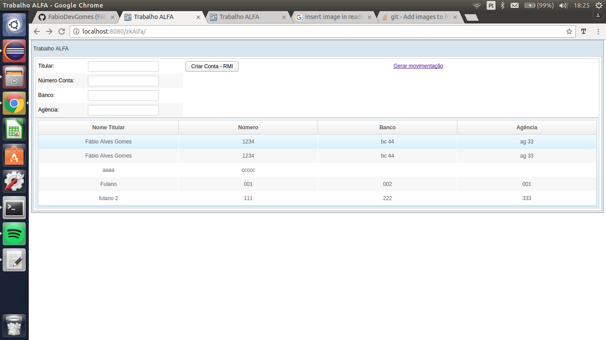
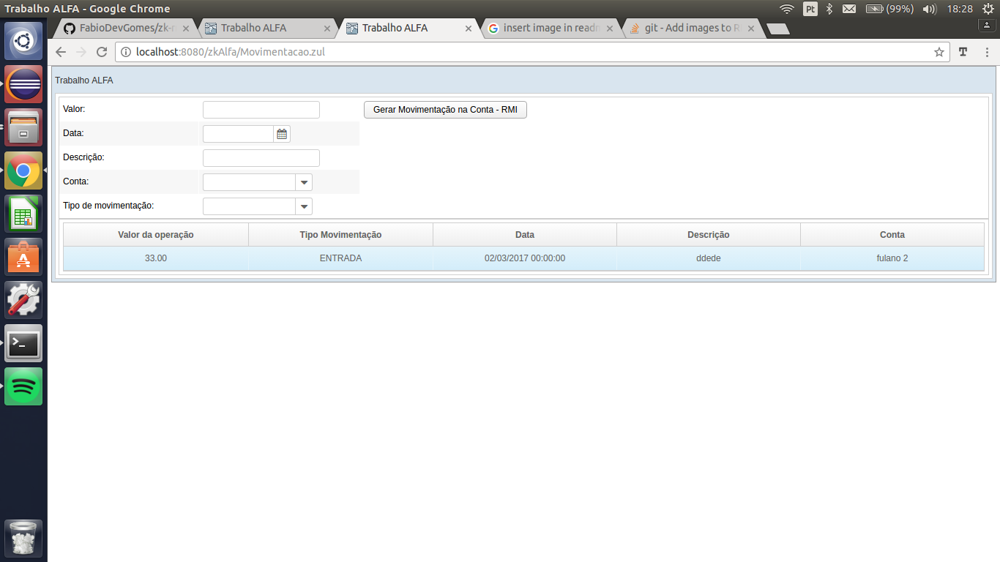

O programa implementado permite a criação e a listagem de contas e também de movimentações, os objetos são criados pelo ZK Framework e enviados ao ServiceImpl através da api RMI para serem persistidos com o uso da especificação JPA.  

Para executar a aplicação siga os passo abaixo:  
0 - Crie o banco "conta" com os dados abaixo ou altere-os  
<property name="javax.persistence.jdbc.url" value="jdbc:mysql://localhost/conta" />  
<property name="javax.persistence.jdbc.user" value="root" />  
<property name="javax.persistence.jdbc.password" value="12345" />  
1 - Baixe o projeto e importe-o 
2 - Encontre a classe ServiceImpl.java no projeto "rmi-server"  
3 - Execute o método main, que será a classe remota, em Java Application, a mensagem "Servidor carregado no registry" deverá ser exibida no console.  
4 - Baixe o projeto "zkAlfa" e execute as atualizações das dependências do Maven  
5 - Execute a aplicação em um servidor ou container (ex.: tomcat)  

Tela de inclusão de contas:

Tela de realização de movimentações

